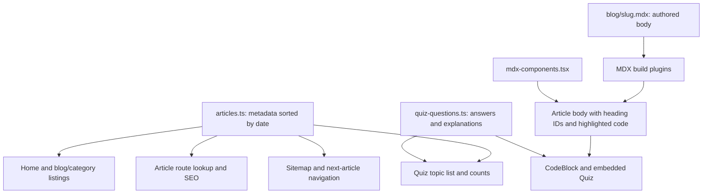

# DailyRefactor project map

## Editorial UI refresh — October 1, 2026

Warm neutral and olive tokens, local Geist typography, a custom abstract hero, typography-led cards, restrained practice/newsletter sections, and a compact footer now form the shared visual system. Page entrances, once-per-view scroll reveals, card rules/arrows, quiz questions, and mobile navigation use short eased transitions. CSS and Web Animations respect reduced-motion preferences; reveal content remains readable without JavaScript. Listing search, independent category links, quiz scoring, and reading tools remain functional.

## Current implementation after remediation — October 1, 2026

The findings in the original review below have been addressed. The original review is retained as a historical baseline; its descriptions of broken behavior and old configuration do not describe the current implementation.

| Original finding | Resolution |
| --- | --- |
| Nested card links / hydration mismatch | Article and category links are siblings. The title link covers the card via CSS; category badges remain independent links. ArticleCard no longer needs a client directive. Browser console is clean. |
| Quick-start Retry resets to an empty/wrong exam | Active topic slugs belong to the session; Retry rebuilds exactly those topics and resets the shared quiz component. Empty exams cannot start. |
| Always-perfect quiz scores | First answers are final. Correct and incorrect answers both permit advancement, display explanations, and remain visible in the recap. Both quiz flows share QuizSession and a tested reducer. |
| Quiz timer race / conditional Hooks | Answer timers were removed. The data wrapper contains no Hooks; the shared session calls Hooks unconditionally. |
| Broken lint configuration / command | Native Next flat presets, an ESLint CLI script, ignored generated/agent directories, and zero-warning validation. All original lint findings resolved. |
| Disabled type validation | Build-time TypeScript validation restored; a dedicated typecheck script is available. |
| Missing search route in structured data | Removed the unsupported SearchAction. Blog search remains available with an explicit label. |
| Geist downloaded but unused | Font variables are mapped to Tailwind font utilities; bundled local Geist fonts eliminate the build-time Google Fonts dependency. Browser computed font confirms GeistSans. |
| Misleading newsletter form | Replaced with a Coming soon notice, as requested. No email entry or subscription promise. Removed unsupported weekly-delivery claims. |
| Accessibility | Real quick-start buttons, pressed topic/filter states, labeled search, menu/TOC expanded states, inert collapsed menu, active-route state, progress semantics, and announced answer feedback. Mobile menu resets on route changes. |
| Duplicate data helpers / quiz UI | Site domain and category slugs centralized in src/lib/site.ts; schema reuses ArticleMeta; both TOC components share heading extraction; both quizzes share the session. |
| SEO timestamps | Article updatedAt is optional and used by schema/sitemap. Listing/category timestamps use actual article dates; unknown static modification dates are omitted. Person schema has a matching function name, and JSON-LD escapes less-than characters. |
| Documentation / missing checks | README now documents the actual layout, runtime, content workflow, checks, newsletter behavior, and license status. GitHub Actions runs lint, types, regression tests, and build. Unused Framer Motion and direct FlatCompat dependencies removed. |

Current commands: npm ci, npm run dev, npm run lint -- --max-warnings=0, npm run typecheck, npm test, npm run build, npm run start. Node >=22.18 is required for the test tooling; Node 24 is recommended. Unsplash remains a runtime network dependency for cover images.

Validation after remediation:

- Lint passed with zero warnings; type checking passed; all four reducer regression tests passed; production build passed with type validation in the sandbox without font downloads.
- Browser home/category navigation showed zero nested anchors and zero console warnings/errors. Geist is applied, and newsletter inputs/search schema claims are absent.
- Standalone and embedded testing quizzes each recorded one wrong answer, completed at 4/5, and restarted correctly. Answer buttons lock after the first answer. Custom two-topic and all-topic exams contained 10 and 60 questions respectively.
- Mobile navigation expanded accessibly and closed on navigation; labeled blog search worked. The latest article showed 30 code blocks and 60 mobile TOC entries, with no horizontal page overflow at 390px.

The application retains the same content and routes. Persistent quiz history, a live newsletter service, and deployment account changes were not requested. Existing agent/skill files were left untouched.

## Original review before remediation

Original review: inspected on October 1, 2026, against commit `a387bc0`. This document records the checked-in application and local production verification. Application source and configuration were left unchanged.

## Purpose and scope

DailyRefactor is Andrés Tascón's English-language software engineering blog and interview practice site. Its actual implementation is a single Next.js application backed by local content files. It has 12 articles, four categories, and 60 multiple-choice questions (five per article).

There is no application database, authentication, CMS, API route, Server Action, email service, analytics integration, or persistent quiz history in this checkout. Java, Spring, databases, wallets, and MCP server code appearing inside MDX are educational examples, not running application services. The newsletter form is a UI placeholder.

## Stack and configuration

| Concern | Implementation |
| --- | --- |
| Framework | Next.js App Router; lockfile resolves Next 16.2.6 |
| UI | React and React DOM 19.2.6 |
| Language | TypeScript 5.8.3, strict mode, `@/*` alias to `src/*` |
| Styling | Tailwind CSS 4 with PostCSS and typography plugin; CSS variables for themes |
| Content | `@next/mdx`, MDX 3, `remark-gfm`, `rehype-slug` |
| Code highlighting | `rehype-pretty-code` with Shiki and `github-dark-default` theme |
| Theme state | `next-themes`, class-based, dark default, system support enabled |
| Images | `next/image`, local author photo, allowlisted `images.unsplash.com` |
| Fonts | Geist and Geist Mono downloaded through `next/font/google` |
| Build engine | Turbopack in both the current dev command and production build |

`next.config.ts` permits JS, JSX, TS, TSX, and MDX page extensions and composes the MDX plugin. Its `typescript.ignoreBuildErrors: true` means a successful build does not prove type safety. Separate type checking is necessary.

The installed Next package requires Node >=20.9.0; the README's Node 18 prerequisite is stale. Verification used Node 24.21.0 and npm 11.19.0. `framer-motion` and the standalone `geist` dependency have no application imports; the fonts actually come from Next's font loader.

## Routes and rendering

| Route | Entry point | Behavior |
| --- | --- | --- |
| `/` | `src/app/page.tsx` | Hero, six newest articles, quiz counts/CTA, newsletter placeholder |
| `/blog` | `src/app/blog/page.tsx` | Metadata wrapper around client-side category filtering and search |
| `/blog/[slug]` | `src/app/blog/[slug]/page.tsx` | Article lookup, MDX import, metadata, reading tools, sharing, next article |
| `/blog/category/[name]` | `src/app/blog/category/[name]/page.tsx` | Category slug lookup and article grid |
| `/quiz` | `src/app/quiz/page.tsx` | Metadata wrapper around topic selection and shuffled quiz sessions |
| `/about` | `src/app/about/page.tsx` | Author biography, photo, external profile links |
| `/sitemap.xml` | `src/app/sitemap.ts` | Static pages, derived categories, all article URLs |
| `/robots.txt` | `src/app/robots.ts` | Allows crawling and links the sitemap |

The production build prerenders these routes. Article and category paths come from `generateStaticParams`; both dynamic page implementations await promised route parameters. Missing articles/categories call `notFound()`. There are no custom error or not-found components. The project does not configure static export or standalone output: its supplied production workflow is `next build`, then `next start`.

`src/app/layout.tsx` supplies global metadata, font variables, styles, WebSite/Person JSON-LD, the theme provider, sticky navigation, and footer. Pages are Server Components unless explicitly marked `use client`; client components still participate in prerendering and then hydrate.

## Content and data flow

`src/content/articles.ts` is the authoritative discoverability registry. It contains ID, slug, title, excerpt, category, human-readable publication date, read-time text, cover image, and repeated author metadata. The exported array sorts in place at module evaluation, newest first. `getArticle` searches by numeric ID; `getArticleBySlug` searches by slug. The numeric lookup currently has no application caller.

Article bodies are separate files under `src/content/blog`. They contain manually authored tables of contents, prose, code examples, and an imported `<Quiz slug="..." />` at the end. They do not use frontmatter for listing metadata. The article route validates the slug against the registry before dynamically importing its matching file.

MDX compilation applies GFM tables/features, generated heading IDs, and syntax highlighting. `src/mdx-components.tsx` maps `pre` to a client `CodeBlock` that displays a language header and copies recursively extracted code text. Authored MDX is executable project content and should be treated as trusted source, not accepted from untrusted visitors.

| Category | Articles |
| --- | --- |
| Java | Testing backends; Java 25; hashCode/equals; immutability; thread safety; dependency injection; concurrency |
| Architecture | ACID transactions; domain-driven design |
| Git | Aliases; ignored files |
| AI | Building an MCP server |

The six home cards currently follow this order: testing backends, Java 25, MCP server, ACID, hashCode/equals, immutability. `NextArticle` selects the following entry in date order, regardless of category, and does not wrap around after the oldest article.

## Interactive behavior and component ownership

| Components | Responsibilities |
| --- | --- |
| `Navigation`, `ThemeToggle`, `ThemeProvider` | Active-route links, mobile menu, scroll styling, dark/light theme and hydration mount guard |
| `Hero`, `Footer` | Home introduction, profile/navigation links, stack labels, rendered copyright year |
| `ArticleCard` | Cover image, category link, excerpt, author/date, article navigation |
| `BlogPageContent` | In-memory category selection plus case-insensitive title/excerpt substring search; no body search or URL synchronization |
| `Quiz` | Sequential embedded five-question quiz with retry feedback and answer explanations |
| `QuizPageContent` | Topic selection, all-topic toggle, quick start, shuffled multi-topic sessions, results and retry |
| `TableOfContents`, `MobileTOC` | Read article h2/h3 IDs from the DOM; desktop active section observer, mobile expansion, smooth scrolling with header offset |
| `ProgressBar`, `BackToTop` | Full-document reading percentage; back-to-top shown after 600px of scrolling |
| `ShareTop`, `ShareSection` | X sharing and clipboard links, with legacy copy fallback |
| `NextArticle` | Link to the next older article |
| `NewsletterForm` | Browser email validation followed by local submitted state; no collection or transmission |
| `CodeBlock`, `JsonLd` | Code display/copy and serialized structured-data script output |

Quiz data is a slug-keyed record with question text, four options, zero-based correct index, and explanation. Sessions use React state only; reloading loses selections, progress, and scores. The standalone quiz combines selected topic questions and uses a Fisher-Yates shuffle; option order stays fixed. A wrong answer shows temporary feedback, a correct answer records a boolean score, and only correct feedback exposes Next/See Results. Answers are bundled into client code, which is appropriate for practice but cannot enforce exam integrity.

Desktop TOC appears at the `lg` breakpoint; mobile TOC covers smaller widths. Both derive headings after mounting. Article prose, inline code, tables, and highlighted blocks are customized in `src/app/globals.css`. Theme transitions are CSS-based; no Framer Motion behavior is implemented.

## SEO and external dependencies

Canonical, sharing, sitemap, schema, and metadata URLs are hardcoded to `https://dailyrefactor.dev` across several files. Moving the domain requires coordinated edits. Article publication and modification schema values currently use the same publication date; article sitemap modification dates also use publication dates. Static/category sitemap dates use the generation time.

The layout's `organizationSchema()` actually returns a Person schema. Article pages add BlogPosting and BreadcrumbList schemas. Open Graph and Twitter metadata use remote article images. There is no generated social card endpoint.

Operational dependencies are npm package retrieval, Google Fonts retrieval during builds, and Unsplash retrieval through Next's runtime image optimizer. X/GitHub/LinkedIn/Oracle links are external navigation. The application itself requires no environment variables; environment references inside fenced article examples are not runtime dependencies. Jev is an optional agent workflow from the supplied instructions, not part of the app.

## Development and publication workflow

Use `npm ci` for lockfile reproducibility, `npm run dev` for development, `npm run build` for production compilation, and `npm run start` to serve the built app. Run `node node_modules/typescript/bin/tsc --noEmit --incremental false` separately while build-time type checking remains disabled.

To publish an article:

1. Add a complete `ArticleMeta` entry with unique ID and slug to `src/content/articles.ts`.
2. Create `src/content/blog/<slug>.mdx` with matching content and valid heading anchors.
3. Add quiz data under the same slug in `src/content/quiz-questions.ts` and include the Quiz import/component in the MDX when desired.
4. If adding a category, add its explanatory copy in the category route. Slugs are lowercase with spaces converted to hyphens; cards, sitemap, and routes currently repeat this transformation.
5. Check types and production compilation; inspect article output, filtering, category routes, metadata, and quiz behavior.
6. Deploy a new build through the host's workflow. Publishing is file-based; no admin UI or content API exists.

There is no checked-in CI configuration, automated application test suite, deployment manifest, Dockerfile, or hosting account configuration. `.gitignore` excludes dependencies, build outputs, environment files, Vercel local state, and generated TypeScript files. The README still contains a placeholder clone URL, references a nonexistent styles directory, and claims an MIT license file that is absent. Recent commits primarily add articles, quizzes, SEO, search, and reading UX.

## Verified issues and repair priorities

| Priority | Finding | Evidence / consequence |
| --- | --- | --- |
| High | Nested links in article cards | `ArticleCard.tsx:26` wraps a card in Link; line 47 adds another Link inside it. Invalid anchor nesting can cause hydration mismatch. Homepage browser logs reproduced React error 418. Removing event bubbling does not fix HTML nesting. |
| High | Quick-start Retry creates an empty quiz | `startSingleTopic` does not update selected slugs; results Retry calls `startExam`, which rebuilds from the selection set. Browser reproduction: quick-start five testing questions, complete, Retry -> 0/0 results. Previous selections can instead restart different topics. |
| High | Scores do not measure initial knowledge | Both quiz components allow advancement only after a correct response and eventually mark every completed question true. Browser reproduction included an incorrect answer yet ended 5/5. Wrong attempts are not recorded; missed-question feedback and lower-score branches are unreachable in normal completion. |
| High | Lint command and configuration fail | `npm run lint` calls `next lint`, interpreted as a nonexistent project directory. Direct ESLint invocation throws a circular-structure error while FlatCompat loads the modern Next presets. |
| Medium | Build ignores type errors | `next.config.ts:17`; current separate type check passed, but future bad types can ship unless checked separately. |
| Medium | Quiz Hooks occur after conditional return | `Quiz.tsx:13` returns for absent quiz before useState calls. Native preset diagnostics flagged four Rules of Hooks errors. Current published slugs all have quizzes, so the invalid case was not a current route failure. |
| Medium | Wrong-answer timers can reset later feedback | Both quiz handlers leave a 1.2s reset timer pending while other answers remain clickable. A quick correct response or changed session can have its feedback cleared by an older timer. Source-derived risk, not a timed browser reproduction. |
| Medium | Search schema describes an absent route | `schema.ts` advertises `/search?q=...`; local `/search` returns 404. Actual search is local state on `/blog`. |
| Low | Geist is loaded but not selected for body text | Layout defines Geist variables, while CSS does not map Tailwind font-sans to them. Browser computed body font was system ui-sans-serif. |
| Low | Accessibility and maintenance gaps | Search/email inputs lack explicit labels; quick start is a clickable span inside a topic button; menu/TOC toggles omit expanded state. Domain/category logic and quiz UI/handlers are duplicated. |

Native Next flat-preset diagnostics, loaded in memory without changing the repository configuration, found 9 errors and 1 warning: explicit `any` in CodeBlock; synchronous setState-in-effect findings in MobileTOC, Navigation, TableOfContents, and ThemeToggle; four conditional-hook errors in Quiz; unused ArticleMeta import in NextArticle. These are diagnostics from a bypass configuration, not a passing repository lint run.

## Verification record and limits

| Check | Result |
| --- | --- |
| Locked dependency installation | Passed; 523 packages installed. npm warned that sharp's install script was not yet approved; tested image optimization nevertheless worked. |
| Production build | Passed with network access; all configured routes prerendered, 25 static-generation entries reported by Next. Initial sandbox attempt failed fetching Google Fonts. |
| Separate TypeScript check | Passed before and after build. |
| Repository lint workflows | Failed as described above. |
| Route smoke checks | All 22 expected HTTP endpoints returned 200; nonexistent article/category and `/search` returned 404. |
| Content integrity | 12 unique registered slugs, 12 matching MDX files, no unlisted MDX, 60 complete four-option questions with valid indices. |
| MDX internal anchors | All manual fragment links in all 12 MDX files matched IDs generated by the actual rehype-slug plugin. |
| Browser home/blog | Rendered; search for immutability narrowed to its one article. Homepage hydration error captured. |
| Browser standalone quiz | Topic picker rendered, quick start worked, wrong/correct feedback and five-question completion worked, scoring limitation and empty Retry reproduced. |
| Browser article | Latest testing article rendered with 30 code blocks, TOC, and embedded quiz. |
| Remote image optimization | Representative Unsplash cover returned HTTP 200 image/jpeg, 19,985 bytes, at width 640 with network-enabled server. Initial sandbox server reported EACCES outbound failures. |

This is an architecture and behavior review, not a comprehensive fact-check or execution of every educational code sample. Full mobile/device coverage, every interaction on every article, external link reachability, dependency security auditing, and live hosting/DNS/analytics settings were not verified. The repository cannot establish production account settings or traffic behavior.

The optional Jev request failed under sandbox networking. Automatic approval review rejected its network-enabled retry because the proposed request would send project-derived metadata to an external gateway. No successful Jev decision was used; inspection continued locally without that optional dependency.
